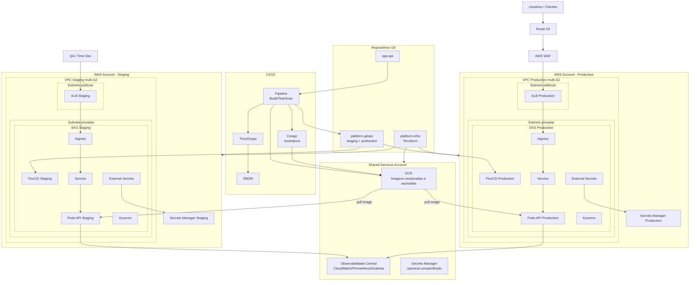

# 01 - Diagrama de Arquitetura Comentado

## Visão geral

A arquitetura proposta foi desenhada para atender aos requisitos do desafio: API pública com alta disponibilidade multi-zone, ambientes separados de staging e production, promoção via GitOps, restrição de acesso direto à produção, validação de imagens em produção e gestão centralizada de secrets com rotação automatizada.

## Separação entre staging e production

A arquitetura considera ambientes separados para staging e production, preferencialmente em contas AWS distintas.

Essa decisão reduz o blast radius e evita que falhas, permissões excessivas ou testes em staging afetem produção.

Cada ambiente possui sua própria VPC, cluster EKS, ALB, FluxCD, políticas de segurança e secrets. O ECR pode ficar em uma conta compartilhada, desde que o acesso cross-account seja controlado por IAM.

O ambiente de staging pode ser sincronizado automaticamente após a pipeline gerar uma imagem aprovada. Já production deve ser promovido por Pull Request no repositório GitOps, usando a mesma imagem validada em staging.

Dessa forma, o time de desenvolvimento consegue validar mudanças em staging, mas não precisa ter acesso direto à produção.

A API é distribuída em múltiplas Availability Zones, com múltiplas réplicas e balanceamento via ALB, garantindo tolerância a falhas de zona.

O Amazon ECR fica na conta compartilhada e armazena as imagens versionadas e assinadas da aplicação.

Tanto o cluster de staging quanto o cluster de production fazem pull das imagens a partir desse ECR compartilhado. O acesso é controlado por IAM cross-account, permitindo que apenas as roles dos nodes ou workloads autorizados consigam consumir as imagens.

A promoção entre ambientes não reconstrói a imagem. A mesma imagem validada em staging é promovida para production por digest, garantindo imutabilidade e consistência entre ambientes.

## Diagrama

